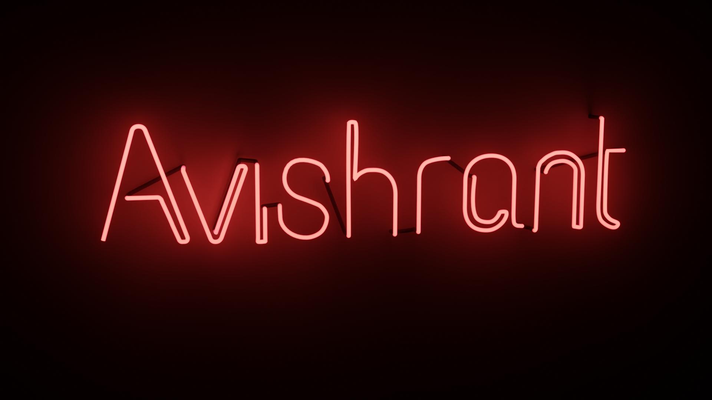

### Hi there 👋

<h3>Hey Guys!</h3>

This is <h1>Avishrant Sharma</h1> 

<h3> 👨🏻‍💻 &nbsp;About Me </h3>
- 🔭 &nbsp; I’m currently working on a IoT Platform powered by Django
- 🎓 &nbsp; Pursuing my Bachelors in Computer Science and Engineering from National Institute of Technology, Hamirpur
- 💼 &nbsp; Coordinator at National Level Hackathon, Electrothon 3.0
- 🌱 &nbsp; Hobby Blender Artist. Also currently exploring the field of Computer Scinece and Engineering.

 

 
<h3> 🤝🏻 &nbsp;Connect with Me </h3>

⭐️ From [AvishrantsSh](https://github.com/avishrantssh)

