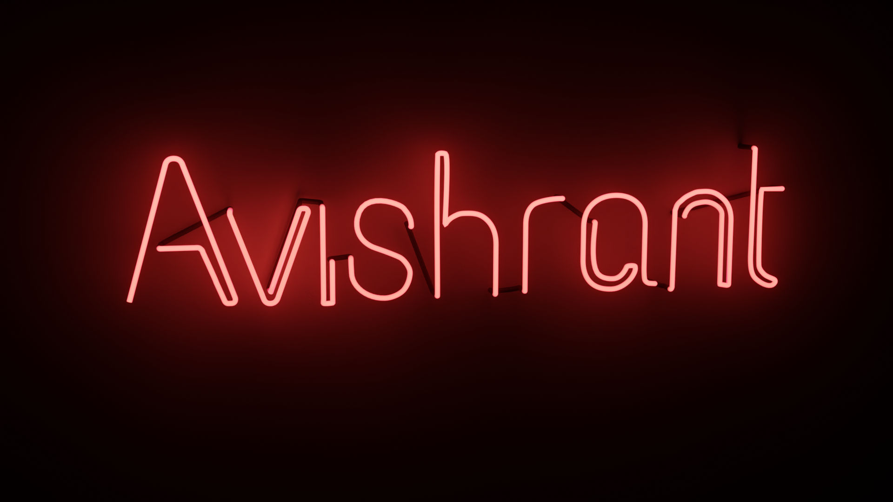

<h2>Hey Guys! 👋</h2>
<h3> 👨🏻‍💻 &nbsp;About Me </h3>
- 🔭 &nbsp; I’m currently working on a IoT Platform powered by Django 
- 🎓 &nbsp; Pursuing my Bachelors in Computer Science and Engineering from National Institute of Technology, Hamirpur 
- 💼 &nbsp; Coordinator at National Level Hackathon, Electrothon 3.0 
- 🌱 &nbsp; Hobby Blender Artist. Currently studying Machine Learning (Tensorflow)  
 

### ⚙️ &nbsp;GitHub Analytics

 

### 🛠 &nbsp;Tech Stack

&nbsp;
&nbsp;
&nbsp;
&nbsp;
&nbsp;
\
&nbsp;
&nbsp;
&nbsp;
&nbsp;

 
<h3>🤝🏻 &nbsp;Connect with Me </h3>

